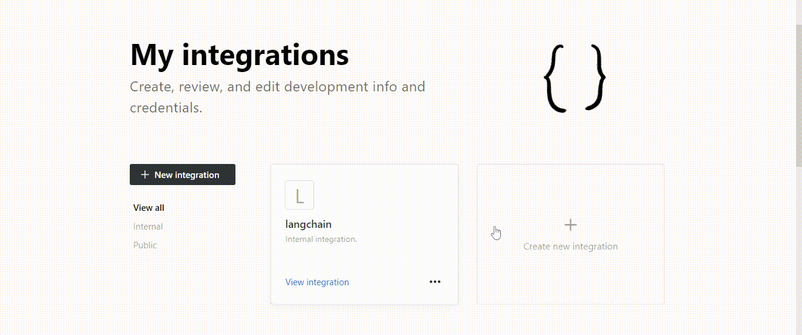
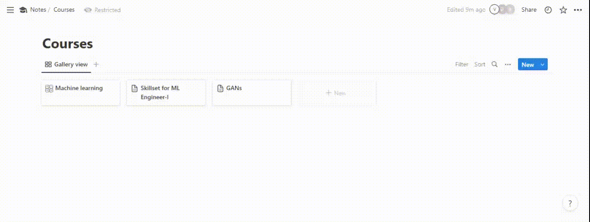

# Notion-DB Bot

## Install

1. Clone this repository and navigate to LLaVA folder

```bash
git https://github.com/dholendar27/Notion-db.git
cd Notion-db
```

2. Install requriements.txt

```bash
pip install -r requirements.txt
```

3. Add `Notion Token` and `Database Id` in the .env file (To get the `notion Token` and `Database Id` follow below steps)

### Follow these steps for creating a Notion Integration:

1. Log in with your Notion account on the (Notion Developers)[https://www.notion.com/my-integrations] page.

2. Select "+ New integration" from the menu.

3. Pick the workspace where your database is situated and give your integration a name.

4. Only the Read content capability is required for this extension, therefore choose the necessary capabilities.

To build the integration, click the "Submit" button. You will receive an Integration Token (API key) once the integration has been setup. You'll need this token to use the NotionDBLoader, so copy it and store it safely.



### The steps below should be followed to link your integration to the database:

1. Open Notion and your database.

2. In the database view's upper right corner, click the three-dot menu symbol.

3. Select "Add Connection" from the menu.

4. You might need to start entering the name of your integration in the search box to find it and select it.



#### Copy the URL of your Notion database to obtain the database ID. Make sure you are viewing the inline database as a complete page if you are using one. To discover the database URL while using the Notion desktop application, click Share and then choose Copy link.


## RUN

```bash
    python main.py
```
